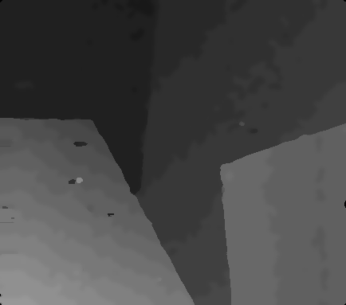

# Computer Vision Hw4

> B05901011 電機三 許秉倫

### Part 1: Depth from Disparity

### Part 2: Disparity Estimation

>  **備註**: 由於我在refine時會用到disparity的灰階圖，因此我有將scale傳入``computeDisp``中

#### Explain your algorithm in terms of the standard 4-step pipeline.

我參考的paper是**Binary Stereo Matching**(Kang Zhang et)

1. cost computation:

   他的概念類似於上課提到的census，但更加強大，首先，他用高斯分佈在一個給定的方形內(邊長 S)，生成K對座標點的``pairs = (pi, qi)``，接著對每對pair做**intensity**的大小比較，若``I(pi) > I(qi)``則為1，反之則為0，經過一番運算，每個點可轉換成一個K bits的布林陣列。

   對左圖和右圖都做完上述運算後，可以開始進行cost computation。

   對左圖的一個點O，我們將其和右圖可能的matching point做xor的運算，算完後數其中共有幾個1，1越少代表越有可能是matching point。
   $$
   C(x, d) = ||B(x)\ XOR \ B(x_d)||_1
   $$
   此步驟做完會有**edge flatten**的問題，亦即邊界切得不夠明確。

2. cost aggregation:

   為了解決edge flatten的問題，我們多加了一項類似regularization的東西
   $$
   w(x, pi, qi) = max(SAD(x, pi), SAD(x, qi))
   $$
   他的用意是希望兩個matching的點顏色盡量不要差太多，並且定一個threshold T，假如w > T則為1，反之則為0，最終亦可得到一個K bits的布林陣列，matching cost變為如下
   $$
   C(x, d) = ||B(x)\ XOR \ B(x_d) \ AND \ \phi(x) ||_1
   $$

3. Disp optimization

   我採用簡單的WTA算法

4. Disp refinement

   1. 先利用left-right consistency，找出invalid的點，對那些點，往左往右走，各找第一個碰到的valid點，然後選兩者中disp較小的補上去。
   2. 再把圖片通過median filter降噪

#### Show your output disparity maps and show your bad pixel ratio. 

| Tsukuba                               | Venus                               | Teddy                               | Cones                               |
| ------------------------------------- | ----------------------------------- | ----------------------------------- | ----------------------------------- |
|  |  |  |  |
| 4.88%                                 | 0.78%                               | 8.81%                               | 7.68%                               |

**Avg score: 5.54%**

#### Your reference papers or websites. 

https://github.com/rookiepig/BinaryStereo

https://arxiv.org/pdf/1402.2020.pdf