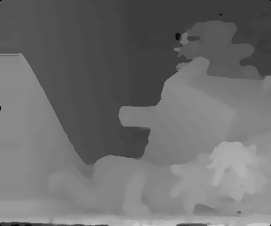

# Stereo Matching
| Image   |                Result                 | Bad Pixel Ratio |
| ------- | :-----------------------------------: | --------------- |
| Tsukuba |  | 4.75%           |
| Venus   |    | 0.85%           |
| Teddy   |    | 8.59%           |
| Cones   |    | 7.65%           |
| Average |                                       | 5.46%           |

```
[Bad Pixel Ratio]
Tsukuba: 4.75%
Venus: 0.85%
Teddy: 8.59%
Cones: 7.65%
Average: 5.46%
```