#  Computer Vision HW2 Report

> B05901011 電機三 許秉倫

### Problem 1

1. Assume 𝑋 is a continuous random variable that denotes the estimated probability of a binary classifier. The instance is classified as positive if 𝑋 > 𝑇 and negative otherwise. When the instance is positive, 𝑋 follows a PDF 𝑓1(𝑥). When the instance is negative, 𝑋 follows a PDF 𝑓2(𝑥). Please specify which regions (A ~ E) represent the cases of False Positive and False Negative, respectively. Clearly explain why.

   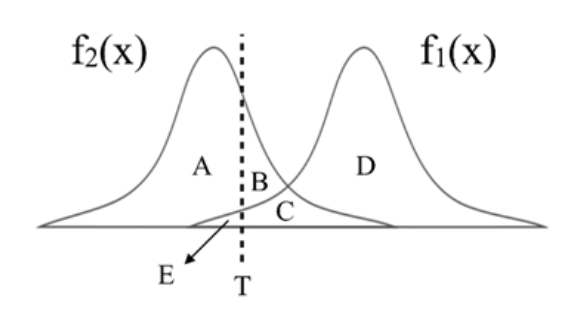

   - False Positive: B + C區。假正，被模型預測為正的負樣本
   - False Negative: E區。假負，被模型預測為負的正樣本 

2. There are three ROC curves in the plot below. Please specify which ROC curves are considered to have reasonable discriminating ability, and which are not. Also, please answer that under what circumstances will the ROC curve fall on curve (b)?

   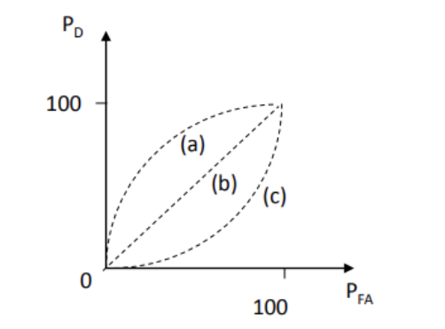

   - a, b為合理的曲線，因為P_D代表的是True Positive, P_FA代表的是False Positive，直觀的來看，不管邊界怎麼移動，P_D必定大於P_FA
   - 當兩種分布完全重疊時，ROC會落在b曲線

## Problem 2

#### 1. PCA

> In this task, you need to implement PCA from scratch, which means you cannot call PCA function directly from existing packages.

1. Perform PCA on the training data. Plot the mean face and the first five eigenfaces and show them in the report.

   |                  Mean                   |                     E1                     |                     E2                     |                     E3                     |                     E4                     |                     E5                     |
   | :-------------------------------------: | :----------------------------------------: | :----------------------------------------: | :----------------------------------------: | :----------------------------------------: | :----------------------------------------: |
   |  | 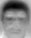 |  | 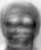 |  | 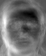 |

2. Take 𝒑𝒆𝒓𝒔𝒐𝒏8_ 𝒊𝒎𝒂𝒈𝒆6, and project it onto the above PCA eigenspace. Reconstruct this image using the first n = { 5, 50, 150, all } eigenfaces. For each n, compute the mean square error (MSE) between the reconstructed face image and the original 𝒑𝒆𝒓𝒔𝒐𝒏8_ 𝒊𝒎𝒂𝒈𝒆6. Plot these reconstructed images with the corresponding MSE values in the report.

   | n    | MSE   | Reconstructed                                  |
   | ---- | ----- | ---------------------------------------------- |
   | 5    | 693.7 | 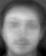   |
   | 50   | 119.2 |   |
   | 150  | 40.40 |  |
   | 279  | 8.42  |  |

3. Reduce the dimension of the image in testing set to dim = 100. Use t-SNE to visualize the distribution of test images.

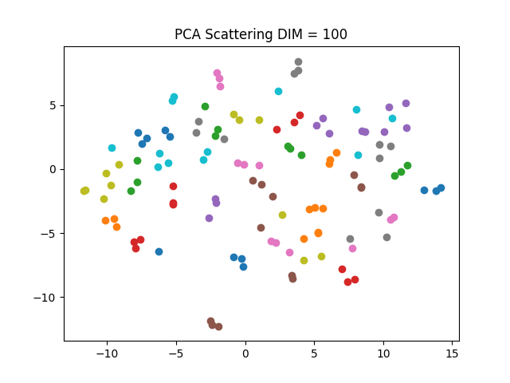

#### 2. LDA

   > In this task, you need to implement LDA from scratch, which means you cannot call LDA function directly from existing packages.

   1. Implement LDA and plot first 5 Fisherfaces.

      | F1                                                | F2                                                | F3                                                | F4                                                | F5                                                |
      | ------------------------------------------------- | ------------------------------------------------- | ------------------------------------------------- | ------------------------------------------------- | ------------------------------------------------- |
      | 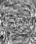 | 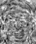 | 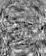 | 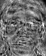 | 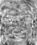 |

   2. Use t-SNE to visualize the distribution of the projected testing data, which has the dimension of 30.

      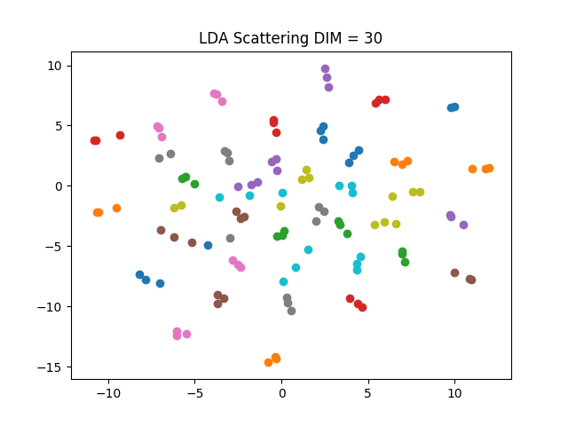

#### 3. KNN

> To apply the k-nearest neighbors (k-NN) classifier to recognize the testing set images, please determine the best k and n values by 3-fold cross-validation. 
>
> For simplicity, the choices for such hyper-parameters are:
>
> k = {1, 3, 5} and n = {3, 10, 39}.
>
> Please show the cross-validation results and explain your choice for (k, n). Also, show the recognition rate on the testing set using your hyper-parameter choice. Please apply the above comparing method on both PCA and LDA.
>
> Do you observe an improved recognition rate using fisherfaces (compared to eigenfaces obtained by PCA)? If so (or if not), what might be the possible explanation?

1. PCA

   選擇在training set上表現最好的(n, k) = (39, 1)來作testing，testing結果也是最好

   | n\k  |                         1                          |                         3                          |                         5                          |
   | :--: | :------------------------------------------------: | :------------------------------------------------: | :------------------------------------------------: |
   |  3   | Validation Acc : 0.66526 Testing Acc : 0.58333 | Validation Acc : 0.64244 Testing Acc : 0.53333 | Validation Acc : 0.48077 Testing Acc : 0.48333 |
   |  10  | Validation Acc : 0.88828 Testing Acc : 0.94167 | Validation Acc : 0.67460 Testing Acc : 0.85000 | Validation Acc : 0.61451 Testing Acc : 0.77500 |
   |  39  | Validation Acc : 0.92685 Testing Acc : 0.95833 | Validation Acc : 0.83170 Testing Acc : 0.93333 | Validation Acc : 0.74098 Testing Acc : 0.90833 |

2. LDA

    LDA的validation非常奇怪，正確率高到不太合理，我想了非常久，才發現應該是因為我們已經拿valid那塊data去作lda了，因此在validation時會有overfit的狀況發生。

   這組參數若選擇正確率最高的(3, 1), (10, 1), (39, 1)的話，在testing的結果很可能壞掉。

| n\k  |                         1                          |                         3                          |                         5                          |
| :--: | :------------------------------------------------: | :------------------------------------------------: | :------------------------------------------------: |
|  3   | Validation Acc : 1.00000 Testing Acc : 0.29167 | Validation Acc : 0.95789 Testing Acc : 0.29167 | Validation Acc : 0.83072 Testing Acc : 0.29167 |
|  10  | Validation Acc : 1.00000 Testing Acc : 0.79167 | Validation Acc : 0.97872 Testing Acc : 0.80000 | Validation Acc : 0.92791 Testing Acc : 0.79167 |
|  39  | Validation Acc : 1.00000 Testing Acc : 0.91667 | Validation Acc : 0.97333 Testing Acc : 0.90833 | Validation Acc : 0.89646 Testing Acc : 0.91667 |

3. **Observation**: 直覺來講lda因為有考慮進去分群的概念，testing set上的acc應當要比較高，但在我的實驗中，沒有這個現象，可能原因推測是訓練資料不夠多，不足以fit出一個好的lda

## Problem3

1. Build a CNN model and train it on the given dataset. Show the architecture of your model in the report.

   

   我使用lenet5當作model，並在其中加入一些``Relu()``

2. Report your training / validation accuracy, and plot the learning curve (loss, accuracy) of the training process.

   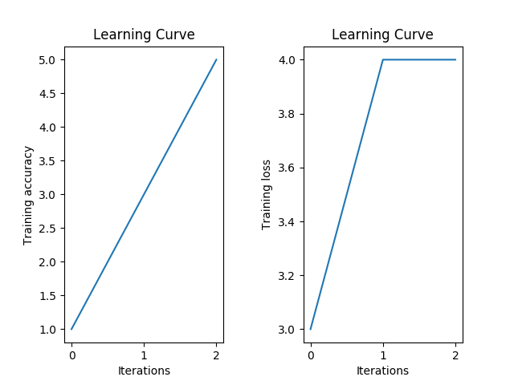

   - Validation - Avg Loss: 1.51086, Accuracy: 0.98580
   - Training - Avg Loss: 1.47237, Accuracy: 0.99412

3. Visualize at least 6 filters on both the first and the last convolutional layers.

   | layer\filter | 0                                  | 1                                  | 2                                  | 3                                  | 4                                  | 5                                  |
   | ------------ | ---------------------------------- | ---------------------------------- | ---------------------------------- | ---------------------------------- | ---------------------------------- | ---------------------------------- |
   | C1           |  | 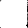 | 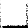 |  | 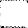 |  |
   | C5           | 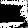 | 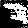 |  | 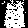 | 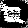 |  |

   由此可見，後層的conv layer，已經可識別出一些類似幾何、簡單筆畫的圖形

4. Visualize high-level and low-level features of 1000 validation data (100 for each class) extracted from different layers, and explain what you have observed from the two t-SNE plots.

   | Low-level(C1 layer)                               | High-level(S4 layer)                               |
   | ------------------------------------------------- | -------------------------------------------------- |
   | 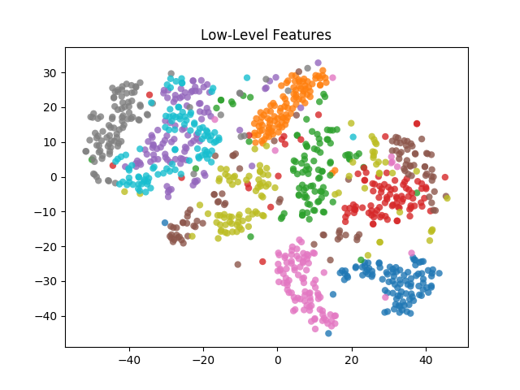 | 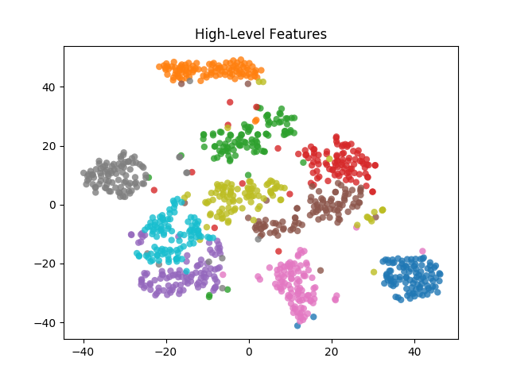 |

   由上圖比較可發現，在high-level時資料分群效果明顯比low-level好很多，原因是越到後層，input的feature更被彰顯出來，將資料分的更開。