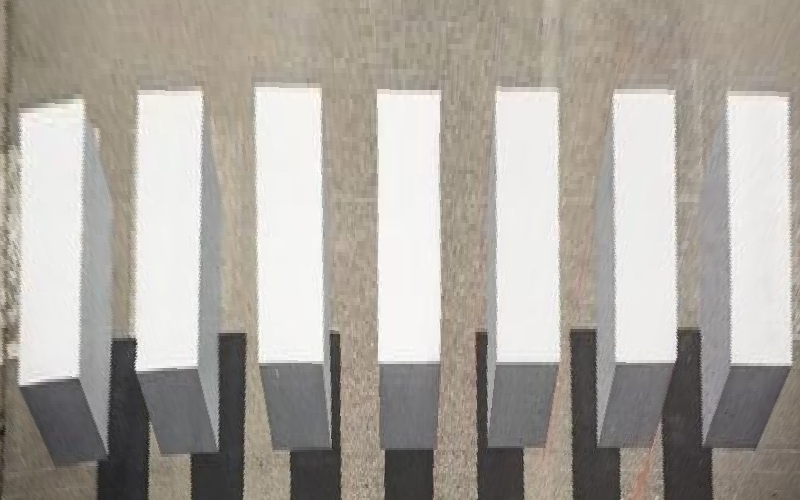

# Computer Vision HW3 Report

> B05901011 電機三 許秉倫


#### Part 1

```python
def point_to_vec(u, v):
   vecs = [
      [u[0], u[1], 1, 0, 0, 0, -u[0] * v[0], -u[1] * v[0], -v[0]],
      [0, 0, 0, u[0], u[1], 1, -u[0] * v[1], -u[1] * v[1], -v[1]]
   ]
   return vecs

def solve_homography(u, v):
   A = []
   for i in range(4):
      t = point_to_vec(u[i], v[i])
      A.append(t[0])
      A.append(t[1])
   A = np.array(A)
   u, s, vh = np.linalg.svd(A.transpose() @ A, full_matrices = False)
   Fn = u[:, 8].reshape(3, 3)
   return Fn
```

​	I use **SVD** to estimate homography. Below is the transformed canvas.


#### Part 2


​	Decoded link: http://media.ee.ntu.edu.tw/courses/cv/18F

#### Part 3 



We **cannot** get parallel bars from top view.


仔細把平行線畫出來後，觀察淺藍色的線，可發現除了最左邊的bar以外都可以完美的服貼在線上，最左邊的bar有一個小小的陷落。

投影時會拿最fit的那條直線(淺藍)來當作上邊，因此，投影後的照片，最左方的bar肯定會像原圖一樣有一個傾斜。

#### Simple AR

- Algorithm
  1. 對於每個frame利用surf，取出feature點
  2. 比對frame和原marker的feature point，取出最相近的若干個點
  3. 算出對應feature點間的轉換矩陣(H)
  4. 將矩陣apply到marker的四個頂點上，即可得到在frame上的頂點
  5. 接下來就使用part1的方法投影，算出自定圖與frame頂點間的H'
  6. 將自訂圖透過H'投到frame上


  但僅僅照上述演算法實作是不夠的，從自定圖投影過去會有缺漏點的問題

  如part2，必須用inverse的作法，但由於canvas上的頂點是不規則狀，因此我們必須找到能包住他的最小長方形，再一一投影回去，而若該點投會去不存在，則不update，如附圖

  

- Reference

  - https://docs.opencv.org/3.4/d7/dff/tutorial_feature_homography.html?fbclid=IwAR0-1FwtXHLus00_9rKC1ScG1tvN-VGo7rDxNg1ZGf0IC9DPyB1ZOhkKQio

- Demo

